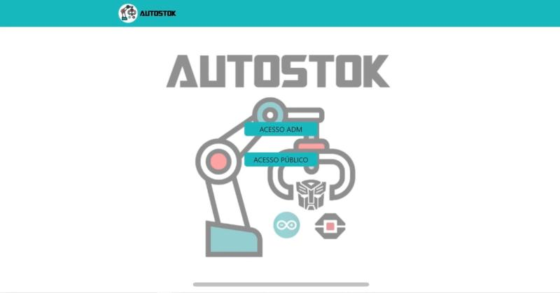
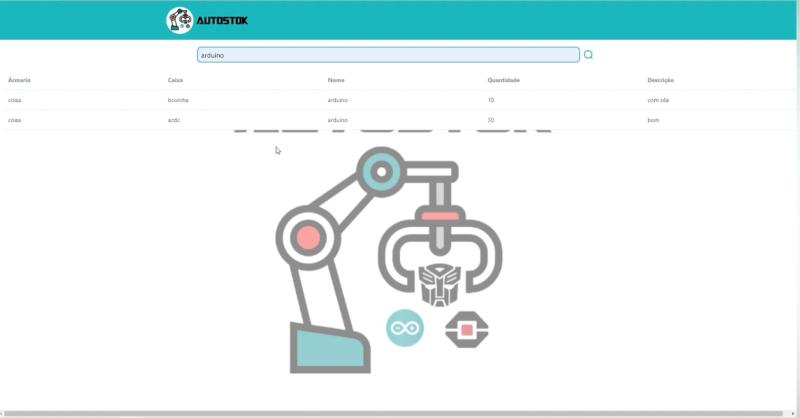
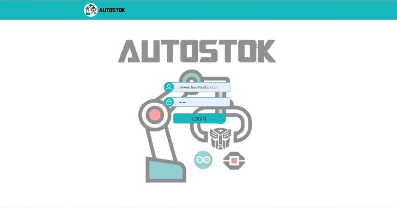
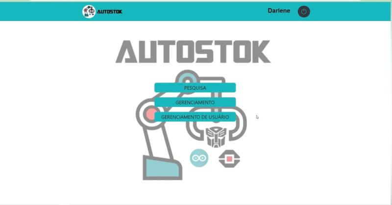
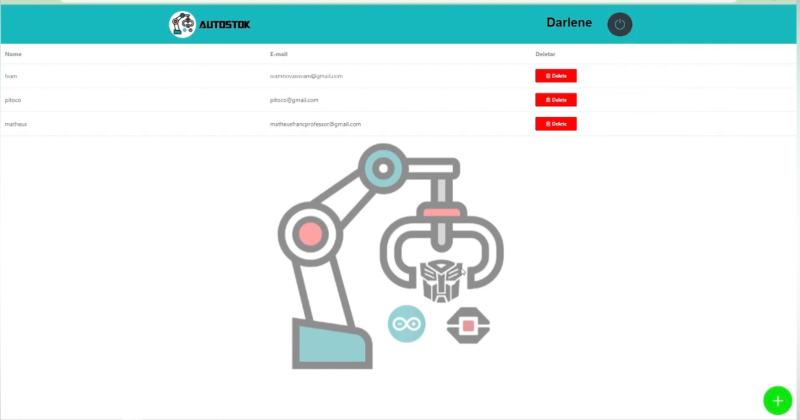
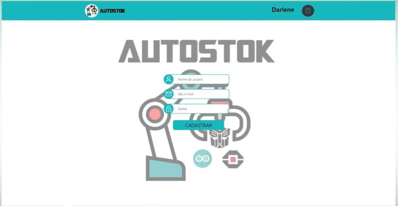
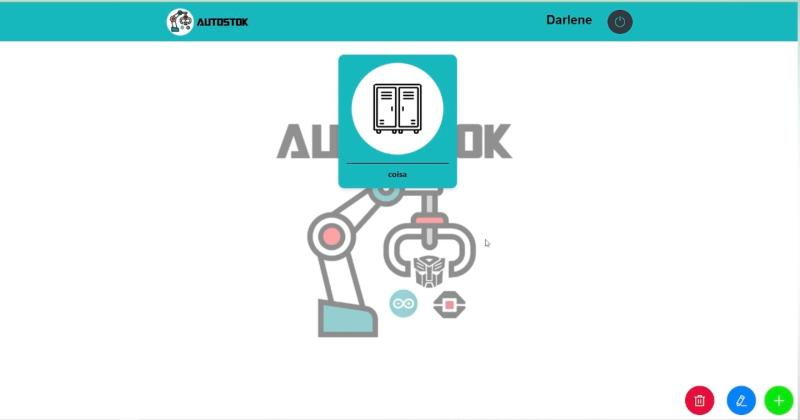
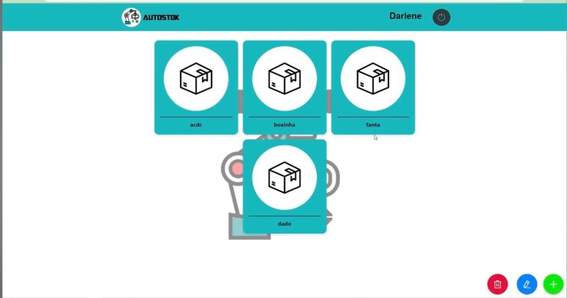
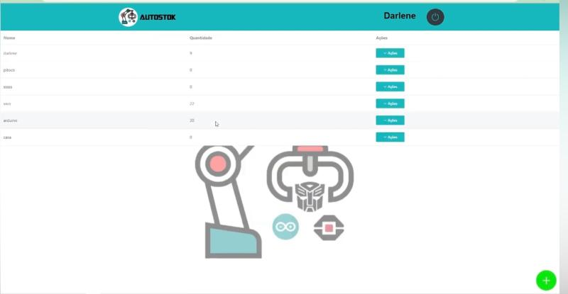

# Autostok Front-End

Este projeto é a interface front-end do sistema **Autostok**, desenvolvido para gerenciar estoques de forma eficiente. A aplicação permite o gerenciamento de itens, caixas, armários e usuários, oferecendo uma experiência intuitiva para administradores e usuários.

## 📌 Funcionalidades

- **Gerenciamento de Itens:** Cadastro, edição e exclusão de itens no estoque.
- **Gerenciamento de Caixas e Armários:** Organização física dos itens.
- **Controle de Usuários:** Cadastro e gerenciamento de usuários com diferentes níveis de acesso.
- **Autenticação:** Sistema de login para administradores e usuários.
- **Acesso Público:** Visualização de itens disponíveis sem necessidade de login.

## 🛠️ Tecnologias Utilizadas

- **Frontend:** HTML, CSS, JavaScript
- **Frameworks/Bibliotecas:** Vue.js
- **Consumo de API:** Integração com o back-end para operações CRUD.

## 🚀 Como Executar o Projeto

Siga os passos abaixo para rodar o projeto localmente.

### ✅ Pré-requisitos

Antes de começar, você precisa ter instalado na sua máquina:

- [Node.js (versão recomendada: 18+)](https://nodejs.org/)
- [Git](https://git-scm.com/)
- [Yarn](https://classic.yarnpkg.com/lang/en/) ou [npm](https://www.npmjs.com/)

### 🔧 Instalação

1. Clone este repositório:

```bash
git clone https://github.com/Darleneleao/autostokFrontd.git
```

2. Acesse o diretório do projeto:

```bash
cd autostokFrontd
```

3. Instale as dependências:

Usando **npm**:

```bash
npm install
```

Ou usando **yarn**:

```bash
yarn install
```

### ▶️ Executando o Projeto

Para iniciar o projeto em modo de desenvolvimento:

Usando **npm**:

```bash
npm start
```

Ou usando **yarn**:

```bash
yarn start
```

A aplicação estará disponível em:

```
http://localhost:3000
```

   
## 📷 Capturas de Tela

### Página de Acesso


### Página de Acesso Público


### Página de Autenticação do Administrador


### Página de Gerenciamento


### Página de Gerenciamento de Usuários


### Página de Cadastro


### Página de Gerenciamento de Armários


### Página de Gerenciamento de Caixas


### Página de Gerenciamento de Itens



